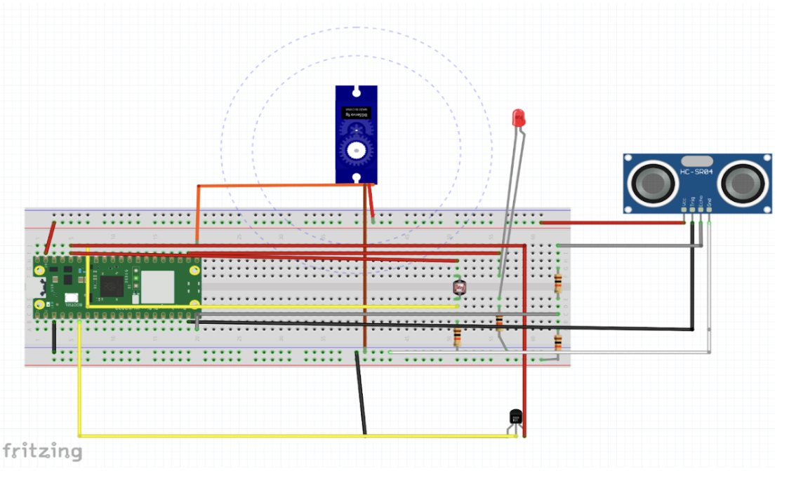
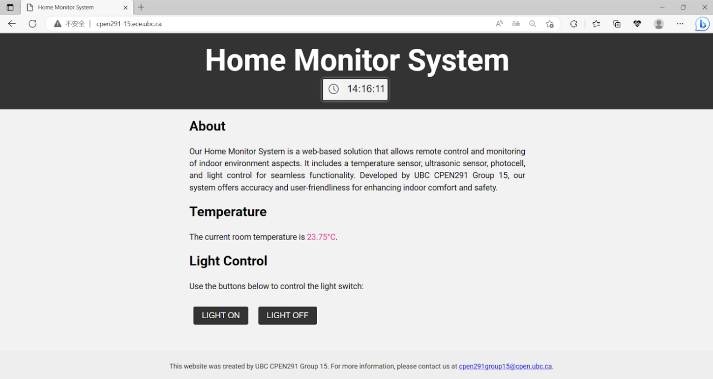

[![LinkedIn][linkedin-shield]][linkedin-url]

<!-- PROJECT LOGO -->

# Home Monitor System
A comprehensive solution designed to enhance home security and comfort through real-time monitoring and automated controls.

## Features
- **Remote Light Control**: Manage your lighting with remote switch functionality.
- **Temperature Monitoring**: Keep track of your home's temperature in real-time.
- **Adaptive Lighting**: Automatically adjusts lighting based on the time of day.

## Technical Documentation

### Hardware Design and Implementation

- Raspberry Pi Pico
- Temperature Sensor
- Ultrasonic Sensor
- Photocell
- Relevant circuitry and connectors

  

### Built With

- HTML/CSS - For web interface design

- JavaScript - For front-end functionality
- CircuitPython - To interface with hardware
- Raspberry Pi Pico - For connectivity and data exchange

## Usage

The Home Monitor System provides real-time monitoring and remote control of household devices. To use the system, follow these steps:

1. Ensure the Raspberry Pi Pico is connected to the relevant sensors and actuators as shown in the setup image.
2. Power on the system and wait for the initialization sequence to complete.
3. Access the web interface through your preferred browser using the system's IP address.
4. Navigate through the dashboard to monitor live feeds, adjust settings, and toggle devices.
5. Use the provided buttons on the interface for immediate manual control of connected devices.

<strong>Home Monitor System Setup</strong>

## Contact

Yixi Lu - yixilu445@gmail.com

Project Link: [https://github.com/Chloeelu/GYM-Database-Management-System/tree/main]

(<a href="#readme-top">back to top</a>)

[linkedin-shield]: https://img.shields.io/badge/-LinkedIn-black.svg?style=for-the-badge&logo=linkedin&colorB=555
[linkedin-url]: https://www.linkedin.com/in/yixilu03/
[Next.js]: https://img.shields.io/badge/next.js-000000?style=for-the-badge&logo=nextdotjs&logoColor=white
